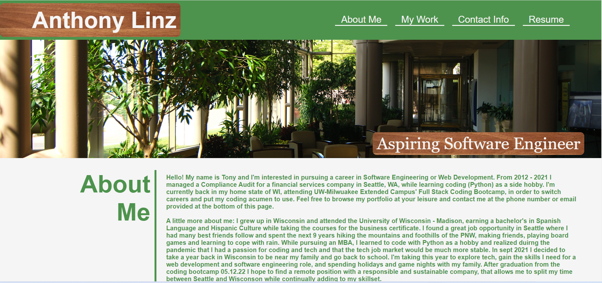
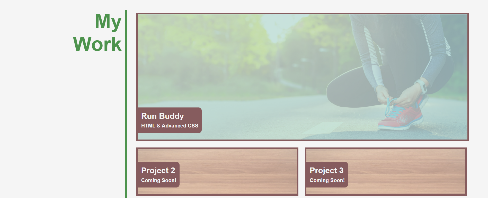
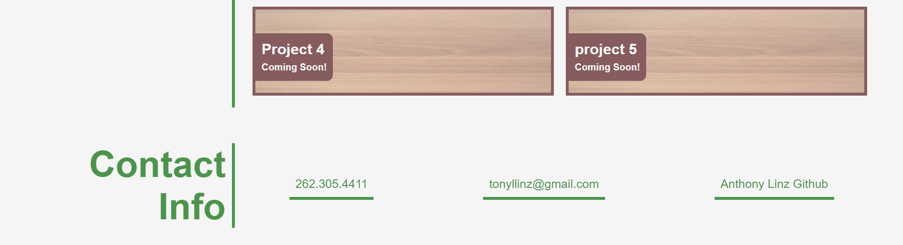

# Challenge 2: Anthony Linz's Portfolio

## **Link** to web application: https://alinz07.github.io/challenge-2-portfolio/
## **Link** to project repository: https://github.com/alinz07/challenge-2-portfolio.git

## **What and Why**
The purpose of this project is to create a portfolio so that hiring managers can review samples of my work and assess if my knowledge and skills fulfill a position's requirements. I expect my portfolio and the web application to evolve as I progress through the coding bootcamp. This project uses strictly html and advanced css.
## Challenge Criteria

GIVEN I need to sample a potential employee's previous work
* WHEN I load their portfolio  
THEN I am presented with the developer's name, a recent photo or avatar, and links to sections about them, their work, and how to contact them 

* WHEN I click one of the links in the navigation  
THEN the UI scrolls to the corresponding section

* WHEN I click on the link to the section about their work  
THEN the UI scrolls to a section with titled images of the developer's applications

* WHEN I am presented with the developer's first application  
THEN that application's image should be larger in size than the others

* WHEN I click on the images of the applications  
THEN I am taken to that deployed application

* WHEN I resize the page or view the site on various screens and devices  
THEN I am presented with a responsive layout that adapts to my viewport

## **How and Why**
This challenge/project is meant to set myself up for future success by applying the core skills I've recently learned: flexbox, media queries, and CSS variables.

## **Things I learned**
Sketching out a design and accepting that the design will change as you go is important. Late in the development of this page I needed to add two container elements to the four same size project tiles in order to keep the outer tile borders in line with the larger tile at different pixel widths. That affected my CSS layout and media queries, but saved me a lot of lines of code and will be viewed much more cleanly on devices of all sizes, while still staying true to the mock up.

## **What makes this project stand out?**
This project is special because of the media queries. It should be easy to navigate and appear clean and professional on all devices from the smallest smart phones to large monitors. If, for whatever reason, someone were to want to view it on a tv, one short media query could be added.

## **Screenshot**
<!-- change these -->

### Credits
* The office image in the hero is from https://potsplantersandmore.com/blog/5-business-boosting-benefits-of-plants-in-the-office/
* The wood background image is from https://pixabay.com/photos/wood-texture-woodenplank-2822120/ 
* The Run Buddy image was provided by UW Extended-Campus full stack coding bootcamp.